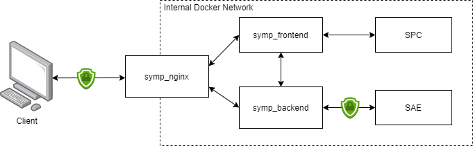
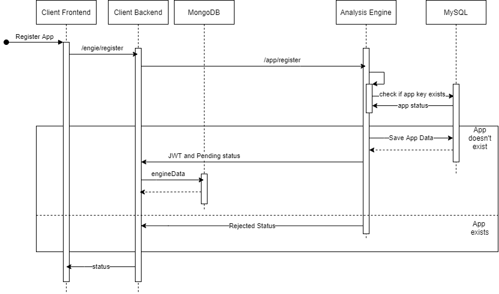

# Client for the SyMP framework
This repository contains a client for the SyMP framework with it's own frontend, backend and databasse

## 1. Overview
The client is built as a PWA with NodeJS and Angular as its core frameworks.

### 1.1 Prerequisites
- Docker-Compose
- SyMP Camunda PlatformFramework
- MYSQL Server
- FTP Server
- Properly configurated [Frontend](https://github.com/FlorianPatzer/symp_client/tree/main/frontend)
- Properly configurated [Backend](https://github.com/FlorianPatzer/symp_client/tree/main/backend)

Note: The [Frontend](https://github.com/FlorianPatzer/symp_client/tree/main/frontend) and the  [Backend](https://github.com/FlorianPatzer/symp_client/tree/main/backend) of the client have their own README, which goes in further detail for their functionality and configuration.

## 2. Starting the client

The instruction described in the READMEs of the [Frontend](https://github.com/FlorianPatzer/symp_client/tree/master/frontend) and the [Backend](https://github.com/FlorianPatzer/symp_client/tree/master/backend) should be followed, to connect the app to custome instance of the SyMP framework.

Note: An of-the-shelf multi container docker-compose setup is available in the repository and the app can be started directly withouth any additional configuration.

1. Run the docerized app:
    ```
    docker-compose up
    ```

2. The current setup is using nginx to expose all of the services on one address. The following endpoints are available after starting the dockerized application:

    Address | Description |
    ------- | ----------- | 
    https://localhost | App Fronend|
    https://localhost/api | App Backend | 

Note: Currently the app is running with self signed certificates and the browser will show a security warning, which has to be accepted in order to access the server.

## 3. Configuring up the client 
 1. Once all services are running, navigate to https://localhost
 2. Login with the default credentials:

    **Username:** admin

    **Password:** admin

    *Note: Change them for better security* 
3. Navigate to the Admin Panel by clicking on the "Administrator" button in the bottom of the side panel
4. Configure the endpoints in the "Client Settings" tab and click on update:
    
    For example:

    **Camunda Endpoint:** http://camunda:8080

    **System Model Engine Endpoint:** http://sme:8544

    **Analysis Hub Endpoint :** http://ah:8545/api/v1/policyimplementation 

5. Register a new SAE in the "Register New Engine" tab:

    For example:
    
    **Engine REST URI:** https://sae:8543/api/v1

    **Subscribe As:** Test App

    **Engine Certificate:** Select the certificate in the engin's folder under **/src/resources/ssl**

6. Select the registered engine as the current active engine in the "Registered engines" tab

7. Activate the app in the engine's frontend

8. Refresh the client and check if the configuration was successfull

## 4. Securing the connections with TLS

Self signed certificates were generated in order to secure the endpoints with TLS. By default applications reject self signed certificates, because they are not generated by a trusted certificate authority (CA) and could lead to security issues. Therefore an additional configuration has to be done to accept only specific self signed certificates which a user (having the role of a local CA) checks and allows manually. Allowing every certificate (i.e. disabling certificate validation) opens a security hole for MITM attacks, therefore it must be omited, on the other side not configuring the allowed certificates will often break connections with an error of "ERR_CERT_AUTHORITY_INVALID" , "DEPTH_ZERO_SELF_SIGNED_CERT", "UNABLE_TO_GET_ISSUER_CERT_LOCALLY" or similar. Each OS and programming framework or software has it's own implementation for certificate validation and therefore it's documentation has to be checked in order to create the propper configuration when working with TLS. 

In the case of the SyMP-Client, it's backend has to communicate with Security Analysis Engines, which have to be registered as trusted to access it's endpoints. The process of registring is described in the following steps.

1. Generating certificates:

   In this example the Java **keytool** and the **openssl** keytoo are utilized. With the following command an RSA keypair (public and private key) are generated and stored in a signle password protected file (a store file) with the PKCS12 standard.

   ```
   keytool -genkeypair -keyalg RSA -keysize 2048 -alias SympClient -dname "CN=**server_address**,OU=**company_unit**,O=**company_name**,C=**country**" -validity 3650 -keystore ./ssl/keystore.jks -storepass **password1** -keypass **password2** -deststoretype pkcs12

   ```

   Some important parameters that have to be tweaked for better security are:
   
       keysize: Size of the key in bits
       validity: Days after which the certificate will expire
       storepass: Password of the store file
       keypass: Password for the private key

    **Important:** The CN filed in the parameter of the -dname flag must point to the actual address of the secured server. This field is used in the process of validation and if the provided value/server address differs from the one where the server is hosted the certificate will be percieved as invalid and the communication will stop.

    After executing the command, a **keystore.jks** file will be created. It is afterwards converted to a .pkcs12 file from which with the help of **openssl** the public and private key will be exctracted in separate file using the .pem standard.

    Converting the file can be done with the following command:

    ```
    keytool -importkeystore -srckeystore ./ssl/keystore.jks -srcstorepass **password1** -destkeystore ./ssl/client.p12 -deststorepass **password3** -deststoretype pkcs12
    ```

    Afterwards the key extraction can be done with the command:

    ```
    openssl pkcs12 -in ./ssl/client.p12 -out ./ssl/**filename with .crt or .pem extension** -password pass:**password3**
    ```

    **Atention:** To extract the public key use the -nokeys flags respectively -nocerts for the privatekey

    The described procedure is available as a bash script in the **/nginx** folder. The user will be only asked to input the server name in order to generate propperly configured certificates. The script is used for securing nginx, but the generated certificates can be applied to anything that that uses tls encryption with chosen standards.

2. Securing the endpoints. 

   The current docker configuration uses nginx as a reverse proxy to expose the frontend and backend on one address. However the communication between the backend and a SAE is done internally in the docker network. This creates the need for two keypairs respectively two certificates. The first one is for encrypting the external network communication (nginx) and the second one for the internal communications between the client and the SAE. The follwoing two steps must be done in order to create the certificates.

   Run the bash script in **/nginx** folder and give the public address of the server (or localhost if it's running locally).

   Run the bash script in  **/backend/src** with and give the internal address of the docker container, which is "symp-backend" in this case.

   The script will generate a folder **/ssl** in the local directory, where the certificates will be stored.

   Afterwards run the application and it will automatically use the generated certificates if the structure is not changed.

   The following diagram presents the connections between the services and shows which are using TLS. 

   

## 5. SAE Registration logic

The client app can have multiple engines registered simultaneously, but is only active and listening for one specific engine. The diagram below presents the logic behind the registration procedure and will be described shortly. For more specific information abou the request structure check the api documentation in the **/docs** folder.



The frontend sends a register request to the backend, containing the engine address, app certificate and key for the specific app. The backend proceeds with the request, configuring some predefined values and sends it to the SAE. The engine checks if an app with the same key exists and either rejects the app or adds it to a pending list, depending on if an app with the same key is already registered or not. Afterwards the engine returns a status, which contains a token that the app has to save and use for each further request to authenticate itself. When the response is received, the app checks the engine certificate and compares it with another that the user provides at the beginning of the procedure. If there is a certificate mismatch, the request is perceived as invalid and the app skips adding the engine data in the database. If the certificate is valid, the app saves the engine in the database and the registration step is over.

Effectively this results in a situation, where the app has added data of a new engine to it's database and is currently listening to it. The engine, on it's side, is informed that the app want's to gain acces to it, and also saves it's data in the database, but still doesn't allow automatically access to it's api. This has to be done manually in a follow-up step, where a user (SAE admin) has to decided if an app should gain rights to communicate with thespecific SAE or not. Once allowed, the app can use the api of the engine by providing the token that it has received at the registration step.

### 5.1 App Statuses

| App side | Engine side  | 
|----------|--------------|
| pending  | active       |
| allowed  | deactivated  |

Each combination of an entry from the left and an entry from the right is possible.

### 5.2 Status description

 - **pending**: The app is registered in the SAE, but an admin still hasn't allowed it to use the engines api
 - **allowed**: The app is registered and an admin has allowed it to use the engines API
 - **active**: The app listening to the specific engine
 - **deactivated**: The app is not listening to the specific engine

 ## Contributors
 Florian Patzer <florian.patzer@iosb.fraunhofer.de>

 Nikolay Penkov <n.penkow@gmail.com>
